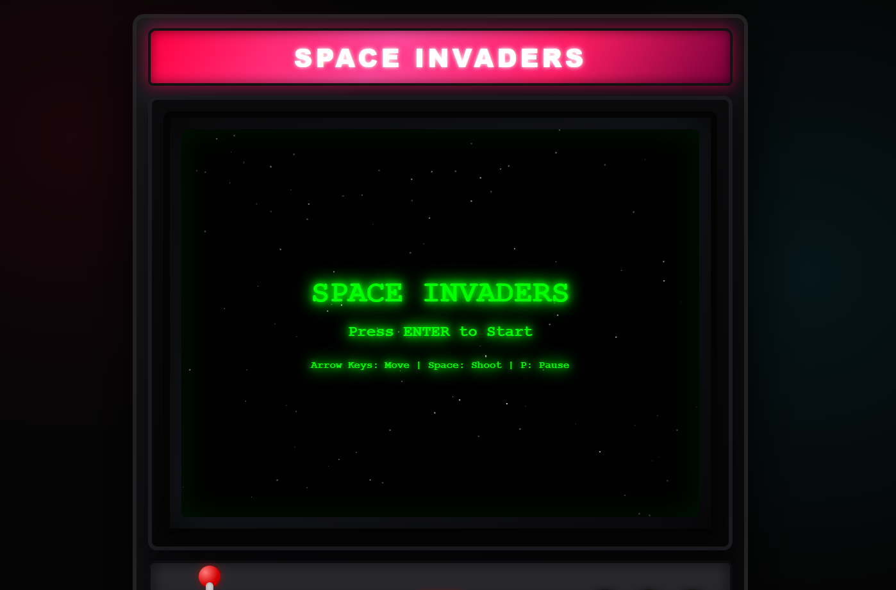
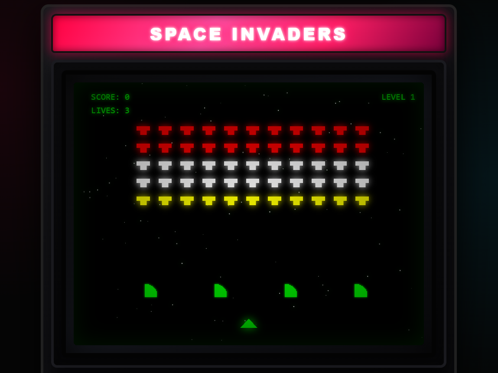
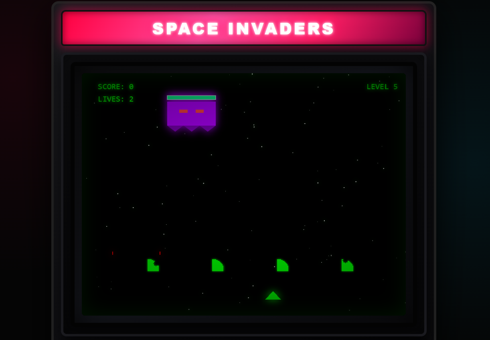

# Space Invaders: Arcade Cabinet Deluxe 👾

Це **Space Invaders: Arcade Cabinet Deluxe** — просунута реінкарнація класичної аркади, реалізована на чистому **Vanilla JavaScript**.

Ця версія перетворює браузер на віртуальну ігрову кімнату з реалістичним **3D-корпусом ігрового автомата**, системою рівнів, битвою з босом, бонусами та динамічним саундтреком.

## 📸 Галерея гри

| Головний екран | Ігровий процес |
|:---:|:---:|
|  |  |

| Битва з Босом | Рекорди та Фінал |
|:---:|:---:|
|  |  |

---

## 🤖 Використання AI-інструментів (AI Stack)
Проект був розроблений за допомогою передових технологій штучного інтелекту:
* **AI Code Editor (Cursor):** Основне середовище розробки, де відбувалося написання коду, рефакторинг та візуальне оформлення кабінету.
* **AI Agent (Gemini):** Виступав у ролі головного архітектора. Саме Gemini генерував складні технічні промпти для Cursor, проектував математичну логіку рівнів, поведінку Боса та систему процедурного синтезу звуку.

---

## 🛠 Процес створення
Розробка відбувалася ітераційно за методологією Prompt Engineering:
1.  **Проектування архітектури:** Gemini створив структуру класів (`Game`, `Boss`, `Particle`) та ігрового циклу.
2.  **Візуалізація:** Через Cursor було створено унікальну CSS-оболонку "Arcade Cabinet" з 3D-ефектами.
3.  **Геймплей та Рівні:** Реалізовано 5 рівнів прогресії, де кожен тип ворога має свої характеристики та HP.
4.  **Звуковий рушій:** Впроваджено `Web Audio API` для генерації звуків у реальному часі без зовнішніх файлів.

---

## 🚀 Основні Нововведення
* **Arcade Cabinet Visuals:** Повністю відмальований через CSS корпус автомата з 3D-джойстиком, кнопками та неоновою вивіскою.
* **Deep Level System:** 5 рівнів складності з різними типами ворогів та механіками.
* **Boss Fight:** Епічна битва з материнським кораблем на 5-му рівні.
* **Power-Up System:** Бонуси, що випадають з ворогів (Швидка стрільба, Щит).
* **Dynamic Audio:** Процедурний звук, темп якого прискорюється ("ефект серцебиття") залежно від кількості ворогів.

---

## 🎮 Як грати
1. Завантажте файл `index.html`.
2. Відкрийте його у будь-якому сучасному браузері.
3. Натисніть **Enter** або кнопку **START** на екрані.

### 🕹️ Керування
Гра підтримує клавіатуру (незалежно від розкладки):

| Клавіша | Дія |
|---|---|
| **⬅️ / ➡️** (або A / D) | Рух вліво / вправо |
| **Space** (Пробіл) | Вогонь (Fire) |
| **P** | Пауза |
| **R** | Рестарт (Працює тільки в режимі **Паузи** або **Game Over**) |
| **Enter** | Старт / Підтвердження |

### 🛠️ Режим Розробника (Debug Mode)
| Клавіша | Ефект |
|---|---|
| **L** | **Skip Level / Kill Boss:** Миттєво знищує всіх ворогів або Боса |
| **H** | **Heal:** Відновлює 3 життя та дає Щит |
| **G** | **God Mode:** Безсмертя |

---

## 📈 Ігрова Механіка та Прогресія

### Рівні (Level System)
1. **Level 1:** Базова швидкість. Вороги мають 1 HP.
2. **Level 2:** Вороги стають швидшими та агресивнішими.
3. **Level 3 (Armored):** Верхні ряди ворогів отримують броню (**Magenta**, 2 HP).
4. **Level 4 (Elite):** Елітні вороги (**Cyan**, 3 HP) та броньовані загони.
5. **Level 5 (BOSS):** Битва з **Mothership** (100 HP). Бос використовує потрійні залпи.

### Вороги та Здоров'я
* 🔴 **Standard (Red/White):** 1 HP.
* 🟣 **Armored (Magenta):** 2 HP.
* 🔵 **Elite (Cyan):** 3 HP.
* 🛸 **Mothership (Boss):** 100 HP + Health Bar.

### Бонуси (Power-Ups)
* ⚡ **[R] Rapid Fire (Yellow):** Кулеметний режим на 5 секунд.
* 🛡️ **[S] Shield (Cyan):** Енергетичний щит, що поглинає 1 влучання.

---

## 🛠 Технічна реалізація
* **Graphics:** HTML5 Canvas API + CSS3 (тіні, градієнти, 3D-трансформації).
* **Audio:** `Web Audio API` (Oscillators/GainNodes) для синтезу звуків.
* **Performance:** Оптимізований цикл `requestAnimationFrame`, роздільна здатність 800x600.
* **Architecture:** Об'єктно-орієнтований JS (`Class Game`, `Class Boss`, `Class Particle`).

## 👤 Автор
**Олексій Гарбарчук** *Проект розроблено в рамках курсу "Вступ до інженерії штучного інтелекту" (2026).*